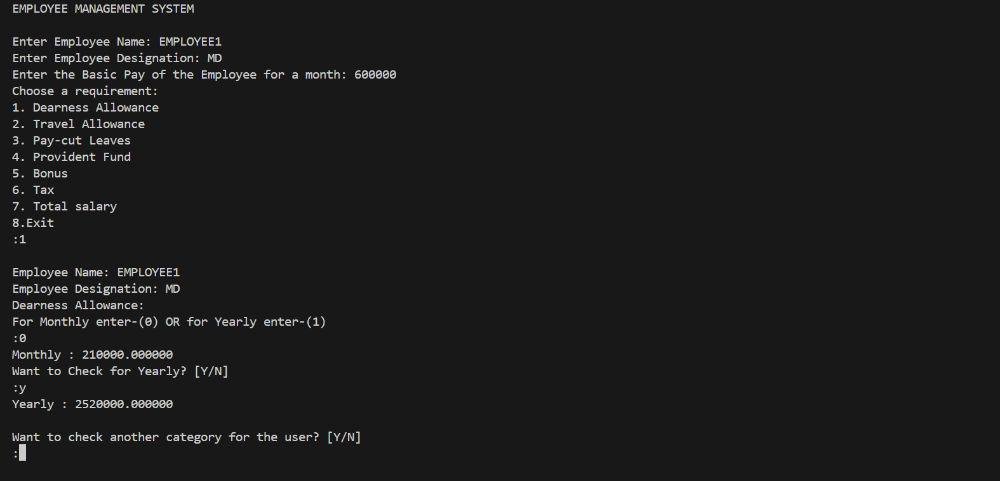
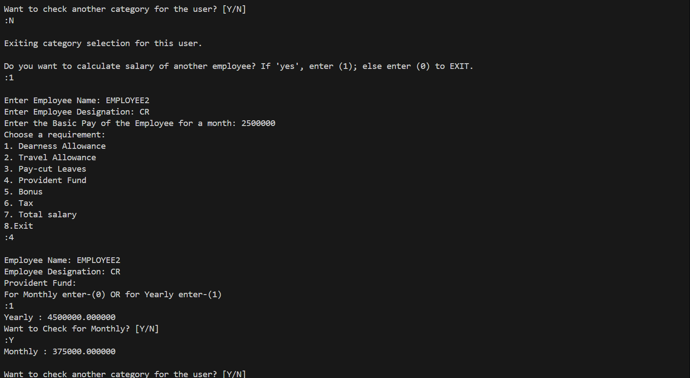

# Employee Management System (C Language)

A CLI-based employee management tool built using linked lists in C. Handles dynamic data entry, salary computation, and various payroll components like DA, TA, bonus, tax, and PF.

## Features
- Add multiple employees with name, designation, and basic pay
- Calculate allowances: DA, TA, Bonus
- Deduct taxes and pay-cut leave penalties
- Supports monthly and yearly salary views
- Uses dynamic memory allocation with linked lists

## Technologies Used
- Language: C
- Concept: Linked Lists
- Tools: GCC compiler, VS Code

## How to Run
```bash
gcc -o ems ems.c
./ems
```

or On Windows
```bash
gcc ems.c -o ems.exe
ems.exe
```
## Sample Output



> These screenshots show employee data input, allowance calculation, and total salary breakdown from the CLI interface.

## To View the Code
[🔗 View Source Code (EMSv2.c)](EMSv2.c)


## Team Members:
- Rishit Ghosh
- Sai Krishna
- Shaik Zaheer Abbas
- Y. Karthik

## Technologies Used
- **Language:** C
- **Concept:** Linked Lists
- **Tools:** GCC compiler, VS Code

## Future Improvements
- Add file-based persistence to save employee data
- Create GUI version using C++
- Implement authentication for HR access

## License
This project is licensed under the [MIT License](LICENSE).
